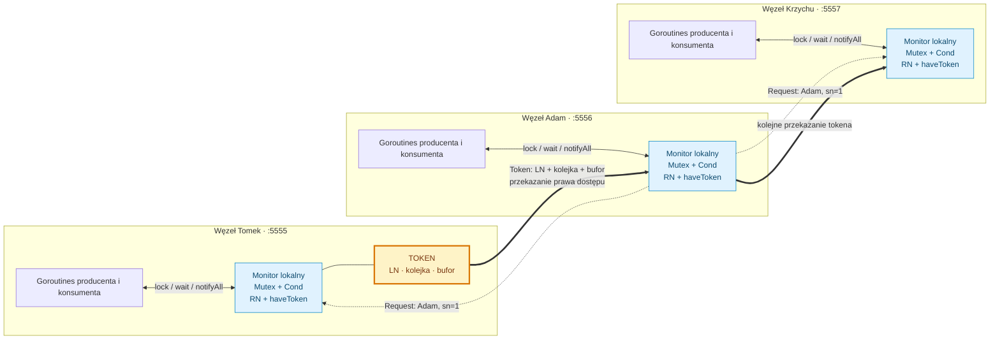
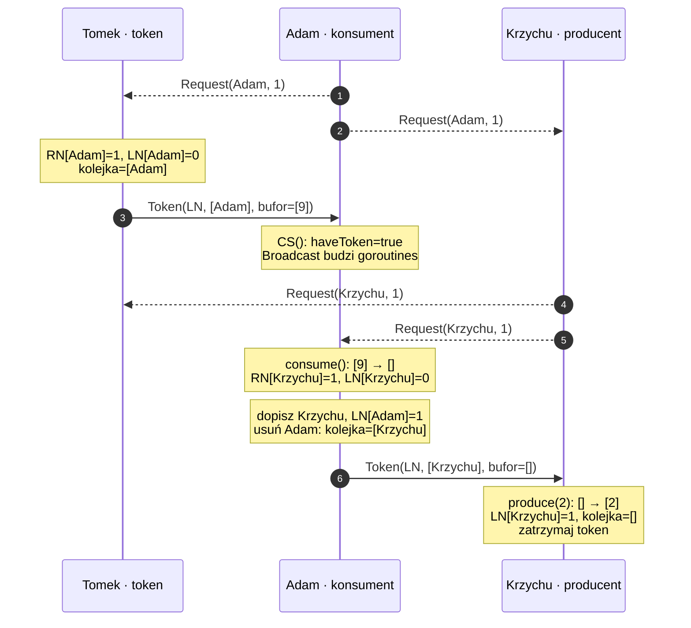

# DistributedMonitor

Monitor rozproszony w Go: lokalne goroutines korzystają ze wspólnego bufora producenta–konsumenta, a prawo dostępu między węzłami przekazuje **token**. Komunikacja odbywa się przez ZeroMQ (`github.com/zeromq/goczmq`) i TCP.

Projekt jest prototypem edukacyjnym. Jego struktury `RN`, `LN` i kolejka tokena odpowiadają algorytmowi **Suzuki–Kasamiego**, rozszerzonemu o przenoszenie danych bufora. Obecna implementacja ma odstępstwa od tego algorytmu i błędy współbieżności opisane poniżej; nie należy przypisywać jej gwarancji poprawnej implementacji protokołu.

## Spis treści

- [Architektura i diagram](#architektura-i-diagram)
- [Algorytm krok po kroku](#algorytm-krok-po-kroku)
- [Przykład liczników i przekazania tokena](#przykład-liczników-i-przekazania-tokena)
- [Monitor i producent–konsument](#monitor-i-producentkonsument)
- [Komunikaty i serializacja](#komunikaty-i-serializacja)
- [Gwarancje i koszt](#gwarancje-i-koszt)
- [Uruchomienie i testy](#uruchomienie-i-testy)
- [Ograniczenia implementacji](#ograniczenia-implementacji)

## Architektura i diagram

Monitor łączy dwa poziomy synchronizacji:

1. `sync.Mutex` i `sync.Cond` koordynują goroutines **wewnątrz jednego procesu**.
2. Przekazywany przez sieć token wyznacza węzeł, który może operować na buforze.

Token zawiera `LN`, kolejkę oczekujących węzłów i `buffor`. Lokalne pole `ProducerConsumer.buffor` jest kopią widoku danych, a operacje produkowania i konsumowania modyfikują `token.buffor`. Nie ma centralnego serwera blokad ani centralnej bazy bufora.

Poniższy diagram pokazuje zamierzony mechanizm. Przerywane strzałki oznaczają żądania, pełne — przekazanie tokena. Faktyczne ograniczenia transportu opisuje sekcja o implementacji.



Diagramy Mermaid renderują się bezpośrednio na GitHubie i w edytorach obsługujących Mermaid.

### Mapa plików

| Plik | Odpowiedzialność |
| --- | --- |
| `Monitor.go` | Inicjalizacja socketów, obsługa żądań, lokalne oczekiwanie i przekazywanie tokena. |
| `token.go` | Kolejka FIFO, liczniki `LN`, bufor i tekstowa serializacja tokena. |
| `ProducerConsument.go` | Operacje `produce`, `consume`, `read`; osadzenie `Monitor` w `ProducerConsumer`. |
| `ProducerConsument_test.go` | Scenariusz trzech węzłów TCP i wielu goroutines w jednym procesie. |
| `token_test.go` | Podstawowe sprawdzenie kolejki i parsowania bufora. |
| `main.go` | Puste `main()`; brak gotowej aplikacji CLI. |

## Algorytm krok po kroku

### Dlaczego token?

Lokalny mutex nie chroni pamięci innego procesu. W tym projekcie węzeł potrzebuje dodatkowego prawa dostępu: `haveToken == true`. Dopiero lokalna blokada i posiadanie tokena pozwalają goroutine zmodyfikować bufor.

Mechanizm opiera się na pojedynczym uprawnieniu krążącym między uczestnikami. Liczniki odróżniają nowe żądanie od już obsłużonego, a kolejka przechowuje uczestników oczekujących na token. Jest to konstrukcja opisana w pracy [Suzukiego i Kasamiego, „A Distributed Mutual Exclusion Algorithm” (1985)](https://dl.acm.org/doi/10.1145/6110.214406). Dalsze omówienie pól i funkcji odnosi się do kodu tego repozytorium.

### Stan lokalny i stan podróżujący

| Pole | Gdzie istnieje | Znaczenie w kodzie |
| --- | --- | --- |
| `id`, `addr`, `address` | Każdy monitor | Tożsamość, własny adres i mapa adresów wszystkich uczestników. |
| `sn` | Każdy monitor | Numer kolejnego własnego żądania, zwiększany w `sendRequest()`. |
| `RN[j]` | Każdy monitor | Największy numer żądania węzła `j`, który ten monitor poznał. |
| `haveToken` | Każdy monitor | Informacja o lokalnym prawie do korzystania z tokena. |
| `asked` | Każdy monitor | Ogranicza ponawianie żądania podczas kolejnych wybudzeń. |
| `blocked` | Każdy monitor | Flaga używana przez `CS()` do zakończenia okresu lokalnej obsługi. |
| `waitedThreads` | Każdy monitor | Liczba operacji po `lock()`, które jeszcze nie wykonały `unlock()`, również tych śpiących w `wait()`. |
| `token.LN[j]` | W tokenie | Numer ostatniego żądania `j` uznanego za obsłużone. |
| `token.queue` | W tokenie | Kolejka identyfikatorów do obsłużenia. |
| `token.buffor` | W tokenie | Aktualne dane współdzielonego bufora. |

`RN` jest wiedzą lokalną: dwa monitory mogą chwilowo znać inne wartości. `LN` przemieszcza się razem z tokenem. Licznik `sn` nie jest zegarem fizycznym ani globalnym zegarem Lamporta — numeruje własne żądania jednego węzła.

### 1. Zgłoszenie potrzeby dostępu

Goroutine wykonuje `lock()`, a następnie sprawdza warunek swojej operacji. Jeśli nie ma tokena, `wait()` wywołuje `askAboutToken()`. Przy `asked == false` i `haveToken == false` następuje `sendRequest()`:

```text
sn := sn + 1
RN[id] := sn
wyślij Request(id, sn)
asked := true
```

`asked` zapobiega generowaniu kolejnego numeru przy każdym przebudzeniu tej samej oczekującej operacji. Jedno żądanie węzła może więc obsłużyć wiele lokalnych goroutines; nie ma osobnego wpisu w kolejce dla każdej z nich.

### 2. Odebranie żądania

W `listenRequests()` nowe żądanie jest akceptowane tylko wtedy, gdy otrzymany `sn` jest większy od zapamiętanego `RN[id]`:

```text
RN[id] := max(RN[id], otrzymany_sn)
```

Powtórzony lub starszy komunikat nie podnosi licznika. Gdy odbiorca ma token i jego kolejka jest pusta, kod dopisuje nadawcę do kolejki i wysyła token. Ten warunek jest istotnym miejscem odstępstwa: pusta kolejka nie dowodzi, że lokalne operacje zakończyły już używanie tokena.

### 3. Rozpoznanie nieobsłużonego żądania

W `CS()` monitor porównuje własne `RN` z `LN` znajdującym się w tokenie:

```text
RN[j] == LN[j] + 1
```

Przykład: `RN[Adam] = 4`, `LN[Adam] = 3` oznacza, że monitor zna czwarte żądanie Adama, podczas gdy token potwierdza obsługę trzeciego. Adam może trafić do kolejki, jeśli jeszcze w niej nie występuje (`token.is(j)`).

Przy `RN[j] == LN[j]` znane żądanie jest już rozliczone. Dokładna równość z `LN[j] + 1` zakłada, że węzeł nie wysuwa kilku nowych żądań naraz bez rozliczenia poprzedniego. Jeśli licznik przeskoczy o więcej niż jeden, ta implementacja nie doda węzła na podstawie tego warunku.

### 4. Odebranie i wykorzystanie tokena

Komunikat `Token` jest parsowany przez `stringToToken()`, po czym odbiorca uruchamia `go m.CS()`.

`CS()` ustawia `haveToken = true`, zeruje `blocked` i budzi lokalne goroutines przez `Broadcast()`. Następnie czeka w pętli z przerwami po 20 ms, dopóki `blocked == false` i `waitedThreads != 0`. Jest to okres udostępniania tokena lokalnym operacjom, a nie ciało pojedynczego `produce()` lub `consume()`.

### 5. Rozliczenie i przekazanie

Na końcu `CS()` kod:

1. Dopisuje do kolejki znane nieobsłużone żądania, bez duplikatów.
2. Ustawia `LN[id] = RN[id]`.
3. Usuwa pierwszy element kolejki przez `DequeueToken()`.
4. Jeśli kolejka ma kolejny element, ustawia `haveToken = false` i wysyła token do jej początku. W przeciwnym razie zatrzymuje token.

W tym wariancie odbiorca pozostaje na początku kolejki podczas swojej obsługi i usuwa ten wpis na końcu `CS()`. `sendToken()` jedynie odczytuje `TopToken()`. Dlatego poprawność wymaga odpowiednio przygotowanej, niepustej kolejki; operacje kolejki nie sprawdzają granic.

## Przykład liczników i przekazania tokena

Załóżmy początkowo: token ma Tomek, bufor to `[9]`, wszystkie `LN` są zerowe. Adam chce konsumować, Krzychu produkować. Poniższy przebieg ilustruje zamierzony protokół przy dostarczeniu wszystkich żądań i braku wyścigów.



| Moment | Istotny stan |
| --- | --- |
| Adam zgłasza dostęp | Adam zapisuje lokalnie `sn=1`, `RN[Adam]=1`. |
| Tomek odbiera żądanie | Tomek poznaje `RN[Adam]=1`; `LN[Adam]` w tokenie nadal wynosi `0`. |
| Adam odbiera token | Kolejka zawiera `[Adam]`; bufor tokena zawiera `[9]`. |
| Adam kończy obsługę | `LN[Adam]=1`; po dodaniu Krzycha i zdjęciu Adama kolejka zawiera `[Krzychu]`. |
| Krzychu kończy obsługę | `LN[Krzychu]=1`; przy braku innych żądań token pozostaje u Krzycha. |

Numery identyczne dla różnych węzłów nie oznaczają tego samego żądania: `(Adam, 1)` i `(Krzychu, 1)` mają różne tożsamości. Kolejność nowych wpisów dopisywanych przez iterację po mapie `LN` jest w Go nieokreślona; nie należy z diagramu wyciągać gwarancji globalnej kolejności zgłoszeń.

## Monitor i producent–konsument

Domyślna pojemność ustawiana w `ProducerConsumer.init()` wynosi **5**.

| Operacja | Warunek wykonania | Zmiana danych |
| --- | --- | --- |
| `produce(i, wg)` | Token jest lokalny i `len(token.buffor) < bufforMaxsize`. | Dopisanie `i` na końcu bufora. |
| `consume(wg)` | Token jest lokalny i bufor nie jest pusty. | Usunięcie pierwszego elementu; metoda nie zwraca wartości. |
| `read(wg)` | Token jest lokalny. | Przypisanie `token.buffor` do lokalnego pola `buffor`. |

Warunki są sprawdzane w pętli `for`, ponieważ przebudzenie nie oznacza, że można wykonać operację. `sync.Cond.Wait()` zwalnia mutex podczas snu i ponownie przejmuje go przed powrotem. Pozwala to innym lokalnym goroutines zmienić bufor i wywołać `notifyAll()`.

Przy pełnym buforze producent czeka na konsumenta; przy pustym buforze konsument czeka na producenta. Gdy potrzebna operacja znajduje się na innym węźle, sam lokalny mutex nie wystarczy — musi przemieścić się token razem z buforem. W kodzie `wait()` ustawia `blocked = true`, co umożliwia zakończenie pętli w `CS()`, ale flaga jest wspólna dla wszystkich operacji i wymaga poprawnej synchronizacji.

`periodicNotify()` dodatkowo wykonuje `Signal()` co 20 ms. Jest to okresowe wybudzanie lokalnego warunku, nie heartbeat sieciowy i nie mechanizm odzyskiwania utraconego tokena. `notify()` i `notifyAll()` również działają tylko w obrębie lokalnego procesu.

## Komunikaty i serializacja

`Request` jest jedną ramką JSON:

```json
{"id":"Adam","type":"Request","sn":1}
```

`Token` zawiera tekstową reprezentację tokena wewnątrz JSON:

```json
{"id":"Tomek","type":"Token","sn":0,"token":"Tomek--0$Adam--0$Krzychu--0$Q:Adam$B:9$"}
```

Format pola `token`:

```text
Tomek--0$Adam--0$Krzychu--0$Q:Adam$B:9$
└──────── LN ────────────┘ └ kolejka ┘ └ bufor
```

- `id--liczba$` opisuje pojedynczy wpis `LN`.
- `Q:` rozpoczyna kolejkę; identyfikatory kończą się `$`.
- `B:` rozpoczyna bufor; liczby kończą się `$`.
- Pusty bufor kończy wiadomość bezpośrednio po `B:`.
- Kolejność wpisów `LN` może się zmieniać, ponieważ serializowana jest mapa.

Parser opiera się na indeksach separatorów i nie zwraca błędów. Nie waliduje identyfikatorów, struktury ani wyników `strconv.Atoi`. Ten format wymaga zaufanych, poprawnych danych i identyfikatorów bez separatorów. Pusta kolejka jest legalnym stanem tokena w pamięci, ale obecny parser nie obsługuje jej poprawnie (fragment `Q:B:` prowadzi do nieprawidłowego zakresu wycinka).

## Gwarancje i koszt

Dla poprawnego protokołu Suzuki–Kasamiego pojedynczy token zapewnia wzajemne wykluczanie przy założeniu, że używa go tylko aktualny właściciel. Standardowy przebieg bez lokalnego tokena wymaga `N−1` dostarczeń żądania i jednego przekazania tokena; dostęp z już posiadanym tokenem nie wymaga komunikacji. Algorytm zakłada sprawnych uczestników i dostarczanie wiadomości; oryginalną analizę zawiera [publikacja autorów](https://dl.acm.org/doi/10.1145/6110.214406).

W strukturach tego projektu każdy monitor utrzymuje mapę `RN` o rozmiarze `O(N)`. Token zawiera mapę `LN`, kolejkę i `B` elementów bufora, więc zajmuje `O(N+B)` danych. Przesyłany jest cały bufor, a nie tylko różnica po ostatniej operacji.

W `CS()` pętla po `LN` sprawdza dla każdego węzła członkostwo w kolejce przez liniowe `token.is()`: w najgorszym przypadku daje to `O(N²)` porównań. Kolejka zachowuje kolejność już zapisanych wpisów, ale kolejność dopisywania nowych wynika z iteracji po mapie. Ponadto lokalna obsługa może grupować wiele operacji pod jednym posiadaniem tokena.

Te koszty nie są dowodem braku zagłodzenia ani wyścigów w obecnym kodzie. Utrata właściciela może zatrzymać system, a stworzenie drugiego tokena może dopuścić równoczesne operacje na rozbieżnych buforach. Repozytorium nie implementuje wyboru nowego właściciela, odtwarzania tokena ani trwałego zapisu stanu.

## Uruchomienie i testy

### Zależności

Potrzebne są Go, kompilator C, `pkg-config`, ZeroMQ, CZMQ oraz zależności wymagane przez wybraną wersję `goczmq`. Na Debianie/Ubuntu biblioteki można przygotować przykładowo tak:

```bash
sudo apt-get install build-essential pkg-config libzmq3-dev libczmq-dev
```

Repozytorium nie zawiera `go.mod` ani `go.sum`. Aby przygotować osobną lokalną konfigurację modułu:

```bash
cd /ścieżka/do/DistributedMonitor
go mod init distributedmonitor
go get github.com/zeromq/goczmq
go mod tidy
```

Te komendy tworzą pliki modułu; repozytorium nie przypina obecnie wersji zależności. Samo `go run .` uruchamia puste `main()` i nie tworzy monitorów.

### Testy tokena bez ZeroMQ

Można uruchomić istniejące testy wyłącznie dla plików tokena, bez zależności C i bez tworzenia modułu:

```bash
go test -v token.go token_test.go
```

Zakres jest ograniczony: test kolejki sprawdza niepustość po dodaniu elementu, a test konwersji porównuje odczytane wartości bufora. Nie sprawdzają całego round-trip, pustej kolejki ani uszkodzonych komunikatów.

### Scenariusz sieciowy

Po przygotowaniu zależności i poprawieniu znanych problemów testu:

```bash
go test -v -run '^TestProducerConsument$' -timeout 30s .
go test -race -run '^TestProducerConsument$' -timeout 30s .
```

Test tworzy trzy monitory w jednym procesie na `127.0.0.1:5555`, `:5556`, `:5557`; porty muszą być wolne. Początkowo token ma Tomek. Test uruchamia 603 operacje: 303 produkcje i 300 konsumpcji, a następnie trzy odczyty.

**Istniejące oczekiwanie pustego bufora jest błędne:** jeśli wszystkie operacje wykonają się raz, pozostają trzy elementy. Test zawiera także wywołania `t.Error` z dyrektywą `%i` zamiast prawidłowego formatowania. Test sieciowy nie jest obecnie wiarygodnym potwierdzeniem poprawności monitora. Odczyty `read()` odbywają się kolejno według dostępu do tokena i nie tworzą atomowego snapshotu wszystkich węzłów.

## Ograniczenia implementacji

Poniższe uwagi wynikają z analizy aktualnych plików, a nie z przeprowadzonej naprawy kodu.

| Obszar | Obecne zachowanie i konsekwencja |
| --- | --- |
| Rozsyłanie żądań | `sendRequest()` wysyła `N−1` razy przez `m.sender`. ZeroMQ `PUSH` rozdziela wiadomości między dostępnych odbiorców, więc liczba wysłań nie gwarantuje po jednej kopii na każdy węzeł. |
| Socket po przekazaniu tokena | `sendToken()` niszczy `sender` i tworzy go dla pojedynczego adresata. Kolejne `sendRequest()` używa tego samego socketu, więc kopie żądania trafiają tylko do tego adresata. Utworzony `broadcaster` nie jest używany do wysyłania. |
| Współbieżność | `RN`, `haveToken`, `blocked`, `waitedThreads` i token są odczytywane lub modyfikowane bez konsekwentnej ochrony mutexem. Dotyczy to m.in. `listenRequests()` i pętli w `CS()`; możliwe są data races i równoczesny dostęp do map. |
| Udostępnianie tokena | Obsługa `Request` sprawdza posiadanie tokena i pustą kolejkę, ale nie wydziela jawnego stanu „token używany lokalnie”. Może wysłać token podczas lokalnej obsługi. |
| Kolejka | `TopToken()` i `DequeueToken()` zakładają niepustość. `CS()` bezwarunkowo usuwa pierwszy wpis. Brak takiego wpisu powoduje panikę. |
| Stan testowy | Wszystkie trzy monitory otrzymują kopię tego samego początkowego `Token`, a mapa `LN` pozostaje współdzielona przez referencję. Nie odwzorowuje to niezależnej pamięci osobnych procesów. |
| Gotowość sieci | `Sleep(100 ms)` po inicjalizacji nie potwierdza gotowości wszystkich połączeń. |
| Zamknięcie | `DestroyMonitor()` niszczy sockety, ale nie zatrzymuje pętli odbiorczej ani `periodicNotify()`. Błąd odbioru może zakończyć proces przez `log.Fatal`. |
| Walidacja i awarie | Brak walidacji JSON, adresata i tokena, potwierdzeń przekazania, odzyskiwania po awarii i utrwalania bufora. |

Semantykę `PUSH/PULL`, w tym rozdzielanie wiadomości w trybie round-robin, opisuje [oficjalna dokumentacja ZeroMQ](https://zeromq.org/socket-api/). Dla tego projektu potrzebne byłoby jawne dostarczenie żądania każdemu innemu uczestnikowi i osobny, stabilny mechanizm adresowania tokena.

Przed traktowaniem prototypu jako poprawnego monitora rozproszonego należy naprawić transport żądań, uporządkować własność stanu i synchronizację, zabezpieczyć serializację oraz skorygować testy. Weryfikacja powinna obejmować wzajemne wykluczanie, postęp, zachowanie liczby elementów bufora i kończenie wszystkich goroutines.
